# Butik Uygulaması

Bu proje, kullanıcıların çeşitli giyim ürünlerini görüntüleyip satın alabilecekleri bir mobil uygulamadır. Uygulama, şık ve kullanışlı bir arayüze sahip olup, kullanıcıların kolayca alışveriş yapmalarını sağlar.

## Ekran Görüntüleri

### Ana Sayfa
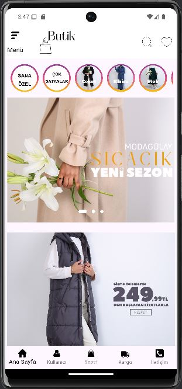 <br>
Yeni sezon ürünleri ve özel indirimler ana sayfada kullanıcıların dikkatine sunulur.

### Giriş Ekranı
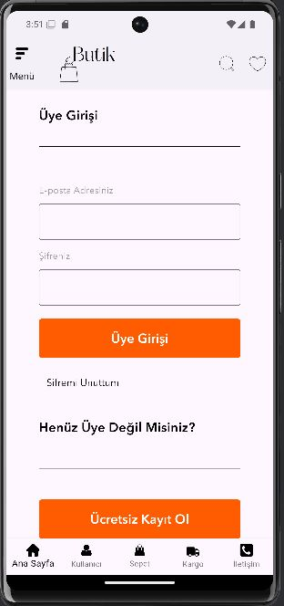
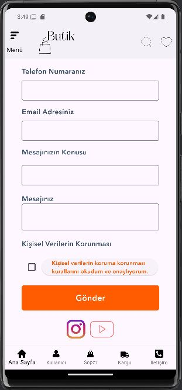 <br>
Kullanıcılar e-posta adresleri ve şifreleriyle giriş yapabilir veya yeni bir hesap oluşturabilirler.

### Ürün Listesi
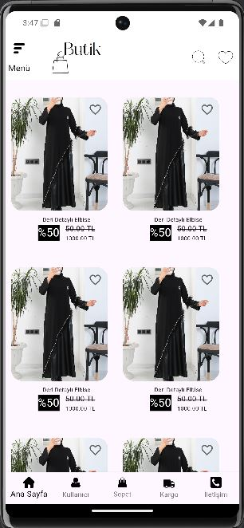 <br>
Kullanıcılar farklı kategorilerdeki ürünleri görüntüleyebilir ve favori ürünlerini işaretleyebilirler.

### Sepet Yönetimi
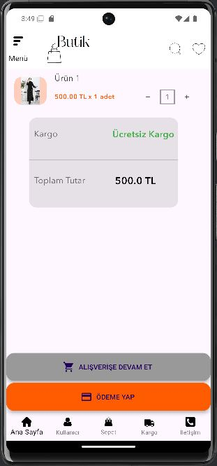 <br>
Kullanıcılar beğendikleri ürünleri sepete ekleyebilir ve satın alma işlemlerini gerçekleştirebilirler.

### Ürün Görüntüleme
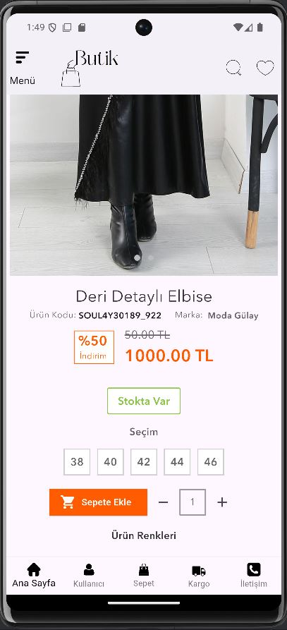<br>
Kullanıcılar çeşitli giyim ürünlerini görüntüleyebilir ve favorilerine ekleyebilirler.


### Ekran Görüntüleri
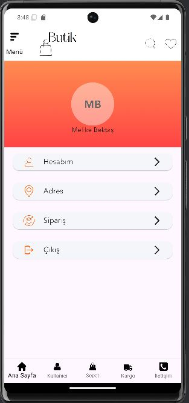
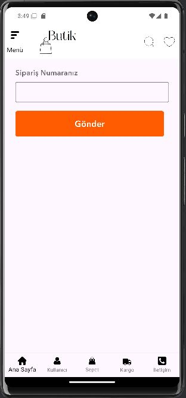 <br>
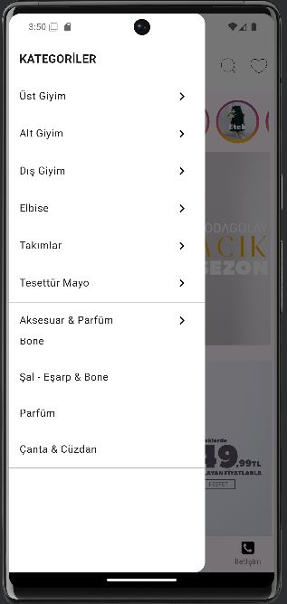
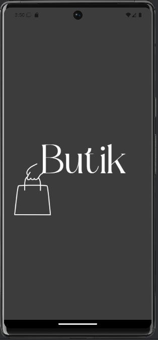 <br>
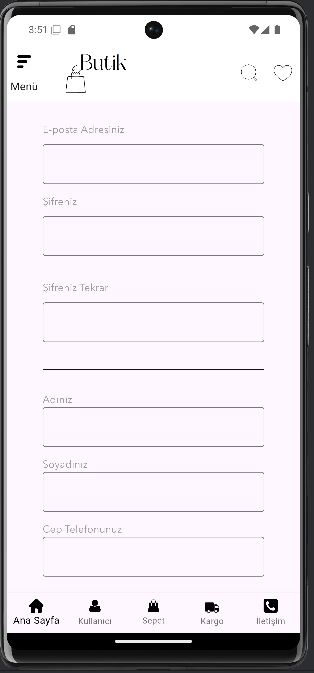
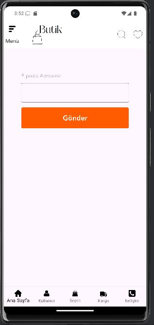 <br>

## Özellikler
- **Üye Girişi ve Kayıt:** Kullanıcılar e-posta adresleri ve şifreleriyle giriş yapabilir veya yeni bir hesap oluşturabilirler.
- **İndirimler ve Kampanyalar:** Özel indirimler ve kampanyalar ana sayfada kullanıcıların dikkatine sunulur.
- **Kolay Navigasyon:** Kullanıcı dostu arayüz sayesinde uygulama içinde kolayca gezinebilirsiniz.


## Kurulum

1. Bu projeyi klonlayın:
    ```bash
    git clone https://github.com/melikebekta/Butik-e-commerce-App-Flutter.git
    ```
2. Proje dizinine gidin:
    ```bash
    cd Butik-e-commerce-App-Flutter
    ```
3. Gerekli bağımlılıkları yükleyin:
    ```bash
    flutter pub get
    ```
4. Uygulamayı başlatın:
    ```bash
    flutter run
    ```

## Kullanılan Teknolojiler

- **Flutter:** Mobil uygulama geliştirme için kullanılmıştır.
- **Dart:** Mobil uygulama geliştirme için kullanılmıştır.
- **Firebase:** Kullanıcı kimlik doğrulama ve veri depolama için kullanılmıştır.

## Katkıda Bulunun

Katkıda bulunmak isterseniz, lütfen bir pull request gönderin veya bir issue açın. Her türlü katkıya açığım!

## Lisans

Bu proje [MIT Lisansı](LICENSE) ile lisanslanmıştır.

## İletişim

Herhangi bir sorunuz veya geri bildiriminiz varsa, lütfen bana ulaşın: [melike.bektas0605@gmail.com](melike.bektas0605@gmail.com)
